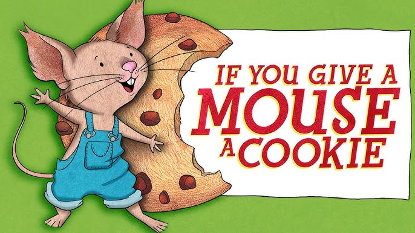

# Cookies
A very fun multipart web challenge

## content
* src -- not provided in the original challenge, it's a flask app for simulating the challenge

## solution
Right away we are greeted with a reference to children's book "If you give a mouse a cookie"

He'll want you to inspect its contents

Opening the devtools and navigating, surely enough we have a single cookie simple titled "cookie" with a very clear base64 encoded message

```
$ echo "QWZ0ZXIgaW5zcGVjdGluZyB0aGUgY29udGVudHMsIGhlJ2xsIGhvcCBvbiB0aGUgUk9CT1QgdmFjY3V1bSBwaWNraW5nIHVwIHRoZSBjcnVtYnMgaGUgbWFkZS4KQ3J1bWIgMTogZFY5Q1FHc3paRjloVA==" | base64 -d

After inspecting the contents, he'll hop on the ROBOT vaccuum picking up the crumbs he made.
Crumb 1: dV9CQGszZF9hT
```

This is a prompt to check the `robots.txt` so we add it to the url


`https://pmodjioz.web.ctf.uscybergames.com/robots.txt`

```
User-agent: *
Disallow: /admin

# The robot vaccuum arrives at a locked door, which naturally he'll want to get inside
# Crumb 2: jB0SDNSX2MwMG
```

Checking the admin folder

`https://pmodjioz.web.ctf.uscybergames.com/admin`

We are greeted with a login and password. At first I thought to try admin for username and a SQL injection for the password field like `'or 1==1 --`. But that wasn't right, it was much simpler... simpy inspect the contents again!

```
    <script>
        const ADMIN_USER = 'admin';
        const CRUMB_3 = 'sxM19mT3JfZEF';
        function login() {
            const user = document.getElementById('username').value;
            const pass = document.getElementById('password').value;
            if (user === ADMIN_USER && pass === CRUMB_3) {
                window.location.href = '/kitchen';
            } else {
                document.getElementById('error').style.display = 'block';
            }
        }
    </script>
```

Crumb 3 is provided here and it happens to be the login. A successful login brings us to the kitchen

`https://pmodjioz.web.ctf.uscybergames.com/kitchen`

```
Index of /kitchen/
Name	Last modified	Size
README.txt	2025-05-18 09:56	121
floor/	2025-05-18 10:19	-
pantry/	2025-05-18 10:22	-
refrigerator/	2025-05-18 10:16	-
stove/	2025-05-18 07:37	-
```

Looking at the readme:
`https://pmodjioz.web.ctf.uscybergames.com/robots.txt`
```
Breaking into the door will make him thirsty, he'll want to find a glass of MILK.
```

Well, milk is in the refrigerator, so checking that directory

`https://pmodjioz.web.ctf.uscybergames.com/kitchen/refrigerator`

```
Index of /kitchen/refrigerator/
Name	Last modified	Size
../	-	-
700$_charcuterie_board.jpeg	2025-05-18 10:16	1652071
Milk.js	2025-05-18 10:03	316
rollCake.mp4	2025-05-18 10:13	116347302
veggies.mp3	2025-05-18 10:14	2217844
```

There's a `milk.js` file here

```
// If he asks for a glass of milk, he's going to want a cookie to go with it.

function pourMilk() {
    console.log("Pouring a fresh glass of milk... 🥛");
}

//TODO: Follow cookie instructions written on NOTE in /kitchen
function bakeCookie() {
    var crumb4 = "fTW9VNWUhISE=";

    return false;
}

pourMilk();

Crumb 3? Try the password on the door.
```

There's no password.txt or something similar, or a door, but exploring around, we can eventuall find on the floor (Guess the note fell)

`https://pmodjioz.web.ctf.uscybergames.com/kitchen/floor`

```
Index of /kitchen/floor/
Name	Last modified	Size
../	-	-
Dust (Another One).mp3	2025-05-18 10:18	5362426
aNoteFallenFromTheFridge.txt	2025-05-18 10:31	553
dust.jpg	2025-05-18 10:19	82084	
```

Ah, there's the note:

```
Steps to making my Fully Layered And Golden (FLAG) Cookie Recipe:

Ingredients:
- 4 Crumbs
- Butter
- Flour
- Sugar

Tools:
- Cookie Editor
- Large Mixing Bowl
- Sheet Pan
- Oven

Instructions:
1) Preheat oven to 320 degrees.
2) Assemble all 4 crumbs in order from 1 to 4.
3) Place assembled crumbs into the oven for 20 minutes to bake into a cookie.
4) Decode the assembled cookie using Base64 until nice and golden.
4) Use Cookie Editor to edit the original cookie with our new assembled cookie.
5) Refresh the home page.
6) Enjoy your FLAG cookie~!	
```

Okay, so we put all the crumbs in order to get this:

`dV9CQGszZF9hTjB0SDNSX2MwMGsxM19mT3JfZEFfTW9VNWUhISE=`

```
$ echo "dV9CQGszZF9hTjB0SDNSX2MwMGsxM19mT3JfZEFfTW9VNWUhISE=" | base64 -d

u_B@k3d_aN0tH3R_c00k13_fOr_dA_MoU5e!!!
```

Navigating back to the front page and changing the cookie yields a different message (our flag):

`SVBRG{he_w1ll_g!v3_y0u_A_fL@g_a5_tH4nk5!}`
